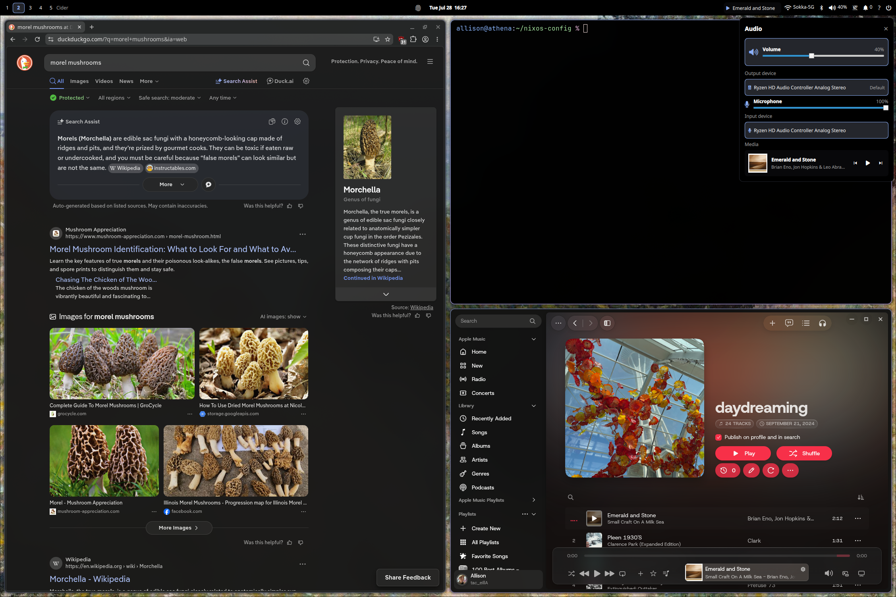
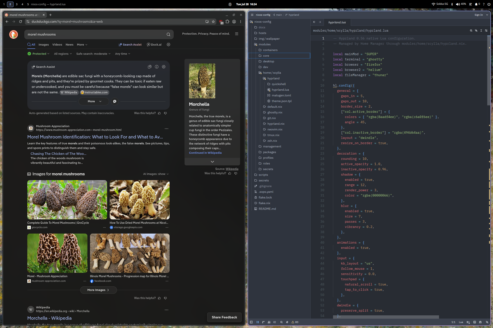

<p align="center">
  
</p>

<h1 align="center">Scylla</h1>

<p align="center">
  A modular NixOS configuration for workstations and servers.
</p>

Scylla uses Nix flakes to define each host. Deployable systems and their role
assignments are declared in `inventory/hosts.nix`; hardware and exceptional
host settings are kept in `hosts/`. Shared modules are in `modules/`.

> [!IMPORTANT]
> This repository contains personal host configurations and encrypted secrets.
> Use `templates/host/` or the `host` flake template for a new system. The
> template does not use SOPS secrets and is not a deployable host output.

## Desktop

Workstation inventory selects Hyprland, Home Manager, Quickshell, and desktop
applications through explicit features.

The shell includes native display controls with rollback, a diagnostics drawer,
and declarative hardware-adaptive profiles. Its component layout, IPC contract,
profile options, and keybindings are documented in
[`modules/home/scylla/hyprland/quickshell/README.md`](modules/home/scylla/hyprland/quickshell/README.md).





## Main features

- NixOS host configurations for workstations and servers
- Shared base, desktop, workstation, and server profiles
- Workstation-only Home Manager configuration for the primary user
- Hyprland with a Quickshell desktop shell
- SOPS secret management for configured hosts
- Service roles for Authentik, DNS, Forgejo, Headscale, Paperless-ngx, Proxy,
  and Vaultwarden
- Host inventory that directly selects profile, feature, role, address, and
  architecture modules
- Proxy ingress generated from validated service publication policies
- Evaluation checks for duplicate addresses/features, unknown or incompatible
  references, invalid feature dependencies, undeclared host directories,
  deployable placeholder hardware, invalid service protocols, duplicate
  public domains, and disabled destination roles
- An installation script for a new or existing host configuration

## Repository layout

| Path | Content |
| --- | --- |
| `flake.nix` | Flake inputs and NixOS host outputs |
| `inventory/hosts.nix` | Host metadata, deployability, profiles, features, roles, and administrative policy |
| `inventory/networks.nix` | Trusted LAN and Tailscale networks used by exposure policy |
| `inventory/services.nix` | Service listeners, exposure policies, and publication metadata |
| `hosts/` | Host configuration and hardware files |
| `templates/host/` | Share-safe host template exposed through the flake |
| `modules/core/` | Minimal boot, firewall, network, shell, and system settings shared by every host |
| `modules/profiles/` | Base, server, and workstation composition |
| `modules/features/` | Cross-cutting desktop, development, gaming, and system features |
| `modules/networking/` | Inventory-driven exposure policy and firewall rendering |
| `modules/home/scylla/` | Home Manager and desktop user settings |
| `modules/desktop/` | Desktop implementation modules used by the desktop feature |
| `modules/roles/` | Directory-based server workload roles |
| `modules/secrets/` | SOPS declarations and Age key settings |
| `scripts/` | Installation and administration scripts |

## Requirements

Before you use the installation script, make sure that:

- NixOS is installed.
- The system can connect to the network.
- Your user can run `sudo`.
- This repository is at `~/nixos-config`.

Some existing host configurations require a SOPS Age key. Do not deploy one
of these configurations if you do not have the correct key.

## Install a new host

Use this procedure after you install NixOS and clone the repository.

1. Open the repository:

   ```console
   cd ~/nixos-config
   ```

2. Run the installation script:

   ```console
   ./scripts/install.sh
   ```

3. Select `Default`.

4. Enter the new host name.

5. Edit `modules/profiles/workstation-user.nix` when Nano opens.

   Check the user name, full name, home directory, and Git identity. Save the
   file and exit Nano.

6. Add the new host to `inventory/hosts.nix` when Nano opens it.

   Select its architecture, profile, deployability, features, and roles. The
   installer will not build a host that is absent or marked non-deployable.

The script performs these tasks:

1. It copies `templates/host/configuration.nix`.
2. It generates `hardware-configuration.nix`.
3. It opens the inventory for the new host declaration.
4. It verifies that the flake exposes the requested hostname.
5. It installs the bootloader.
6. It builds the configuration with `nixos-rebuild boot`.

The script does not reboot the system. Reboot the system manually after the
script reports a successful build.

```console
sudo reboot
```

Commit the new `hosts/<host-name>/` directory and its inventory entry if you
want to keep the host configuration in the repository.

## Install an existing host

Use this procedure only when the repository already contains the correct host
configuration and hardware file.

1. Run the installation script:

   ```console
   cd ~/nixos-config
   ./scripts/install.sh
   ```

2. Select `Other`.

3. Enter the name of the existing host configuration.

4. Reboot the system after the script reports a successful build.

## Rebuild a host

Run this command to activate a configuration immediately:

```console
sudo nixos-rebuild switch --flake ~/nixos-config#$(hostname)
```

Run this command to build the configuration for the next boot:

```console
sudo nixos-rebuild boot --flake ~/nixos-config#$(hostname)
```

After the initial configuration, open a new shell session. The following
aliases are then available:

| Alias | Action |
| --- | --- |
| `update` | Update the flake inputs in `flake.lock` |
| `rebuild` | Build and activate the current host configuration |
| `rebuild-boot` | Build the current host configuration for the next boot |
| `garbage` | Delete old Nix store generations |

The `update` alias does not rebuild the system. Run `rebuild` or
`rebuild-boot` after `update` when you are ready to apply the updated inputs.

## Configure the primary user

The file `modules/profiles/workstation-user.nix` contains the default
workstation user information. Desktop modules read its `scylla.user` options.

This module is imported only by the workstation profile. The available options
are:

```nix
scylla.user = {
  name = "user-name";
  fullName = "User Name";
  homeDirectory = null; # null uses /home/<user-name>
  git.name = "Git Author";
  git.email = "user@example.com";
};
```

To add another system account, add `users.users.<name>` to a host-specific
module. The `scylla.user` account is the primary Home Manager desktop account.

## Add a host manually

1. Create `hosts/<host-name>/`, starting from the host template:

   ```console
   mkdir hosts/<host-name>
   cp templates/host/configuration.nix hosts/<host-name>/configuration.nix
   ```

2. Keep host configuration focused on its hardware file and exceptional
   overrides:

   ```nix
   { ... }:

   {
     imports = [ ./hardware-configuration.nix ];
   }
   ```

3. Generate the hardware file:

   ```console
   sudo nixos-generate-config --show-hardware-config \
     > hosts/<host-name>/hardware-configuration.nix
   ```

4. Add the host to `inventory/hosts.nix`. The inventory selects the profile,
   architecture, address, deployability, features, and enabled roles.

The flake intentionally rejects host directories that are absent from the
inventory.

## Configure host features

Every feature named in `inventory/hosts.nix` imports exactly one module. Server
hosts currently select only CLI development tools and the Tailscale service:

```nix
features = [
  "development-minimal"
  "tailscale"
];
```

Workstations explicitly select desktop, audio, firmware, AppImage, printing,
gaming, Distrobox, development, Tailscale, and desktop-operator integration as
needed. `tailscale-operator` requires both `tailscale` and `desktop`, and a host
may select only one of `development-minimal` or `development-full`.

Firmware updates are not part of the server profile. Add `firmware` to a
specific server only when its hardware requires fwupd.

## Configure a workload role

All role modules are imported centrally and default to disabled. Enable a role
through a host's inventory entry and keep role settings limited to
service-specific behavior:

```nix
roles = [ "forgejo" ];
roleSettings.forgejo = {
  oidcDiscoveryUrl =
    "https://auth.example.com/application/o/forgejo/.well-known/openid-configuration";
  installAdminPackages = false;
};
```

Disabled roles create no service users, listeners, global packages, or SOPS
declarations. Roles do not open their own firewall ports. Listener addresses,
ports, and domains come from validated service inventory; exposure policy
alone decides which sources can reach those listeners.

## Publish a service

Declare service listeners, exposure policy, and publication metadata in
`inventory/services.nix`:

```nix
forgejo = {
  host = "forgejo";
  role = "forgejo";
  listener = {
    address = hosts.forgejo.address;
    domain = "git.example.com";
    port = 3000;
    protocols = [ "tcp" ];
    scheme = "http";
  };
  exposure = {
    classification = "proxy-only";
    trustedHosts = [ "proxy" ];
    trustedNetworks = [ ];
    consumedByProxy = true;
  };
  publication = {
    via = "cloudflare";
    domain = "git.example.com";
  };
};
```

Cloudflare ingress is generated from entries with
`publication.via = "cloudflare"`. Do not add an `ingress` map to the proxy
host. A Cloudflare-published origin uses `proxy-only` exposure: the public edge
is Cloudflare, while the backend accepts traffic only from the inventory
address of the central proxy. The `public` classification is reserved for a
listener intentionally reachable without a trusted-source restriction.

Trusted CIDR ranges are declared once in `inventory/networks.nix`. LAN-only
services may use only declared LAN networks, Tailscale-only services may use
only declared tailnet networks, and proxy-only services must trust exactly the
deployable proxy host. Raw DNS is LAN-only on TCP and UDP 53. DNS dashboards
and application backends are proxy-only.

The listener domain belongs to the workload even when no publication is
configured. For a Cloudflare route, the publication domain must match the
listener domain.

Evaluation rejects invalid or duplicate listener sockets, missing and
non-deployable hosts, disabled roles, unsupported protocol combinations,
undeclared trusted hosts or networks, policy/classification mismatches,
duplicate domains, manual listener settings, and Cloudflare destinations
without valid proxy-only policy.

Deployable servers also declare administrative SSH exposure in host inventory.
OpenSSH no longer opens its port automatically; TCP 22 is currently restricted
to the declared LAN and Tailscale networks. The proxy has no inbound
application exposure and retains only these administrative SSH rules.

## Secret management

Scylla uses `sops-nix` and an Age key at:

```text
/var/lib/sops-nix/age-key.txt
```

The host template does not declare a SOPS secret. Secret-consuming roles
declare their own SOPS files, Age key settings, ownership, and restart targets.

Do not commit an unencrypted secret or an Age private key.

## Placeholder hosts

Placeholder systems remain visible in `inventory/hosts.nix` with
`deployable = false`. The flake refuses to expose a deployable host whose
hardware file still contains the template disk labels.
